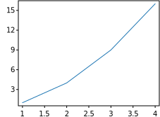

# svg-cpp-plot
A simple C++17 header-only library for generating SVG plots. 


## Quick plotting tutorial

Plotting with svg-cpp-plot is designed to be similar to (or more accurately, a subset of) `matplotlib.pyplot` or `MATLAB` in terms of plotting. Each method makes some change to a figure: e.g., creates a figure, creates a plotting area in a figure, plots some lines in a plotting area, decorates the plot with labels, etc. There is, however, a small difference: all the functions are translated into methods of the class `svg_cpp_plot::SVGPlot`.

Generating visualizations with pyplot is very quick:

```cpp
svg_cpp_plot::SVGPlot plt;
plt.plot({1,2,3,4});
plt.ylabel("some numbers");
plt.savefig("../doc/example1.svg");
```
generates the following graph:


You may be wondering why the x-axis ranges from *0-3* and the *y*-axis from *1-4*. If you provide a single list or array to the `plot()` method, it is assumed that it represents a sequence of *y* values, and automatically generates the *x* values for you, starting from *0* (in this case `{0, 1, 2, 3}`).

`plot()` is a versatile method. For example, to plot *x* versus *y*, you can do

```cpp
svg_cpp_plot::SVGPlot plt;
plt.plot({1, 2, 3, 4}, {1, 4, 9, 16});
plt.savefig("../doc/example2.svg");
```
to include also specific values on the *x* axis and therefore generate



Of course the `plot()` method is not limited to bracketed lists. It can also work with any STL linear container of floating point numbers (such as `std::list<float>`). Additionaly, a python-like `arange(<start>,<stop>,<step>)` is provided as a list generator. These are illustrated in the following code:

```cpp
svg_cpp_plot::SVGPlot plt;
float f=-1.0;
std::list<float> l; 
for (int i=0; i<100;++i) l.push_back(f*=-1.005);
plt.plot(svg_cpp_plot::arange(0,5,0.05),l);
plt.savefig("../doc/example3.svg");
```

that generates 


