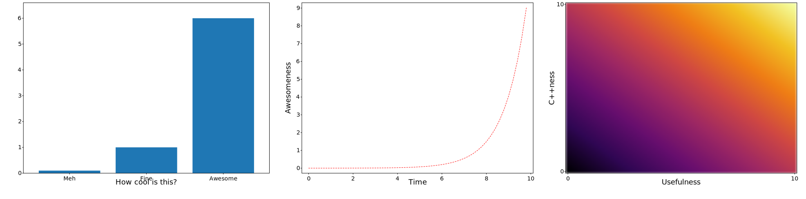

# SVGPlot

## Example teaser

```cpp
svg_cpp_plot::SVGPlot plt;
plt.subplot(1,3,0).xlabel("How cool is this?").bar({"Meh","Fine","Awesome"},{0.1,1,6});
plt.subplot(1,3,1).ylabel("Awesomeness").xlabel("Time").plot(svg_cpp_plot::arange(0.0,10.0,0.2),[] (float x) { return std::exp(x)/2000.0f; },"r--");
plt.subplot(1,3,2).ylabel("C++ness").xlabel("Usefulness").imshow(svg_cpp_plot::arange(0.0,10.0,0.2),svg_cpp_plot::arange(0.0,10.0,0.2),[] (float x, float y) { return x+y; }).interpolation("bicubic").cmap("inferno");
plt.savefig("../doc/svgplot/teaser.svg");
```

<div style="text-align:center"></div>


## Description

Plotting with `svg-cpp-plot` is designed to be similar to (or more accurately, a subset of) `matplotlib.pyplot` or `MATLAB` in terms of plotting. Each method makes some change to a figure: e.g., creates a figure, creates a plotting area in a figure, plots some lines in a plotting area, decorates the plot with labels, etc. There is, however, a small difference: all the functions are translated into methods of the class `svg_cpp_plot::SVGPlot`. Each of these methods provides a functionality similar to their `matplotlib.pyplot` counterparts. The result of the diagrams can be saved into an svg file, which is easily converted to other formats. 

The provided functionality is rather small, compared to the well stablished `matplotlib.pyplot`. While I am expanding it to fulfill my own needs, some very niche features will never ever be provided. However, the provided functionality seems to be enough (at least for my needs) given the fact that the resulting diagrams can easily be edited and tweaked afterwards, for instance with the vector drawing software [Inkscape](https://inkscape.org/).  

Also, this is for now a single author project so I am updating the documentation with features which I deem stable but there are some other features that I don't consider ready and usable so they won't be documented (so you don't use them). Also, my documentation style is not very formal and tends to illustrate the functionality through examples (which is what very often works for me when I read documentation). 

## Named parameters

In `matplotlib.pyplot` (as generally in Python) it is actually possible to use any parameter as a **named** parameter, which very often enables functions and methods to have many parameters with default values and only set the values of a few of them as needed. This is specially useful for diagrams in which most of the times you want to have smart default values that affect appearance and only define the ones that matter for the information you aim to convey. 

However, C++ does not have any kind of support for named parameters, so in `svg_cpp_plot::SVGPlot` these are defined as postfix methods that return references to the same class, so they can be concatenated. 

For example, the Python call

```python 
plt.imshow(data, interpolation = 'bicubic', extent = [0,1,0,1], vmin=0, vmax=1, cmap='inferno')
```

is emulated as

```cpp
plt.imshow(data).interpolation("bicubic").extent({0,1,0,1}).vmin(0).vmax(1).cmap("inferno");
```

which although technically are not named parameters they look similar hence we will call them named parameters throughout the documentation.


## Diagrams 
The provided methods that generate different types of diagrams are:

- [`plot`](./svgplot/plot.md): plots *x,y* graphs with different styles and configuration options. 
- [`scatter`](./svgplot/scatter.md): generates *x,y* scatter plots with potential visualizations of more variables through marker colors or sizes.
- [`imshow`](./svgplot/imshow.md): plots two-dimensional data.
- [`bar` and `barh`](./svgplot/bar.md): generates bar graphs.
- [`hist`](./svgplot/hist.md): generates histograms from 1D samples.

Also, the appearance of the diagrams can be modified and/or combined through:
- [`subplot`](./svgplot/subplot.md): Enables generating figures with multiple plots with relative positioning between them.

## Saving

Finally, the method `savefig("file.svg")` enables the saving of the corresponding plot into the *file.svg* file. The format of this svg is designed so that it holds reasonably well when converting it to pdf, for instance with the vector drawing software [Inkscape](https://inkscape.org/). 

In fact, with Inkscape it is possible to convert `svg` to `pdf` using the command line.

```
inkscape file.svg --export-type=pdf --export-filename=file.pdf
```

By default, the `savefig()` method expects file with `svg` extension. Other extensions are supported: `png`,  `pdf` amd `eps`, but they require Inkscape to be installed and its executable accesible from the command line path, while the `svg` output does not require additional software.

## C++ plotting alternatives

There are several alternatives to `svg-cpp-plot` for plotting from C++.
- [**sciplot**](https://github.com/sciplot/sciplot) - Requires [gnuplot](http://www.gnuplot.info/)
- [**Matplot++**](https://github.com/alandefreitas/matplotplusplus) - Requires [gnuplot](http://www.gnuplot.info/)
- [**matplotlib-cpp**](https://github.com/lava/matplotlib-cpp) - Resembles `matplotlib`, and requires an installed version of `matplotlib` with python interoperability.

In contrast `svg_cpp_plot::SVGPlot` resembles `matplotlib` and has no dependency, except for, optionally, `libpng` for interpolated `imshow`.


