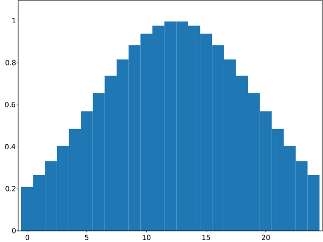
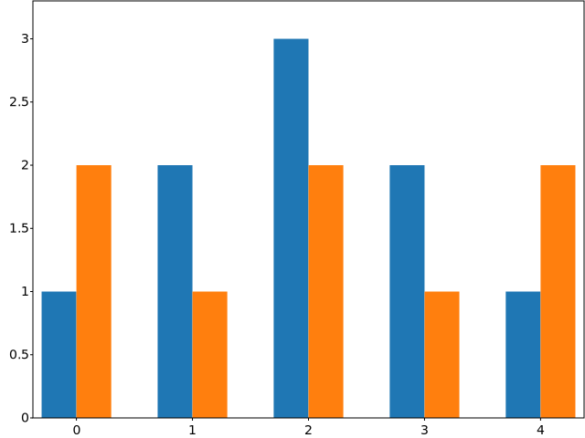
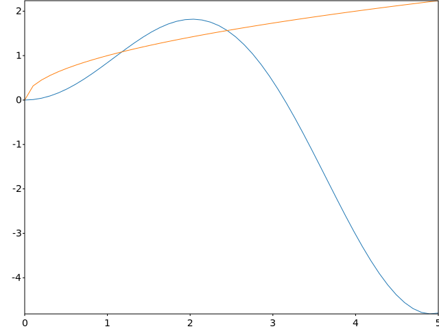

# GNUPlot::bar

The `bar` method provides a simple way of generating bar diagrams from the `svg_cpp_plot::SVGPlot` class:

```cpp
svg_cpp_plot::SVGPlot plt;
plt.bar({"G1","G2","G3","G4"},{1,2,3,4});
plt.savefig("../doc/svgplot/bar/example1.svg");
```

The `bar` method expects two parameters that are vectors (or any collection type) of preferrably the same size: 
- the center positions of the bars on the *x*-axis
- the height of each of the bars

However, the first parameter can also be a collection of strings, hence becoming a shortcut for naming the xticks of the plot adequately. The above example is basically a shortcut for

```cpp
svg_cpp_plot::SVGPlot plt;
plt.bar(svg_cpp_plot::arange(4),{1,2,3,4});
plt.xticks(svg_cpp_plot::arange(4),{"G1","G2","G3","G4"});
plt.savefig("../doc/svgplot/bar/example1b.svg");
```

Both generate the same diagram:

<div style="text-align:center"></div>
	
Of course the `bar()` method is not limited to bracketed lists. It can also work with any STL linear container of floating point numbers (such as `std::list<float>`). Additionaly, a python-like `arange(<start>,<stop>,<step>)` is provided as a list generator. These are illustrated in the following code:

```cpp
svg_cpp_plot::SVGPlot plt;
std::list<float> v;
for (auto i : svg_cpp_plot::arange(25))
    v.push_back(std::exp(-(float(i)-12.5f)*(float(i)-12.5f)/100.0f));
plt.bar(svg_cpp_plot::arange(25),v).width(1.0f);
plt.savefig("../doc/svgplot/bar/example2.svg");
```

The code above also ilustrates the named parameter `width` that set ups the width of all the bars. If instead of a floating point number a vector / container is passed as parameter, it can actually set up different widths for each bar. The result of the above source code is the following:

<div style="text-align:center"></div>

##Combining several bars

There are two main ways of combining different bars in the same diagram. The first option is to have side-by-side bars. In order to do so, the `width` of each of them must be obviosly smaller and you need to put each of them at different *x*-axis positions but at the same interval. For that purpose, the `arange(<start>,<stop>,<step>)` provides operators (`+`, `-`, `*`, `/`) with floating point numbers. All these can be seen in the following example: 

```cpp
svg_cpp_plot::SVGPlot plt;
float width = 0.3;
std::vector<float> a{1,2,3,2,1};
std::vector<float> b{2,1,2,1,2};
plt.bar(svg_cpp_plot::arange(5)-0.5*width,a).width(width);
plt.bar(svg_cpp_plot::arange(5)+0.5*width,b).width(width);
plt.xticks(svg_cpp_plot::arange(5));
plt.savefig("../doc/svgplot/bar/example3.svg");
```

that generates 

<div style="text-align:center"></div>

The other option is to have *cumulative* bars. For that, the `bottom` named parameter (which in C++ is modeled as a method) can set different *y*-axis positions for the bottom of each bar, and hence can also be used to define where one of the bar stops and the other starts:

```cpp
svg_cpp_plot::SVGPlot plt;
std::vector<float> a{1,2,3,2,1};
std::vector<float> b{2,1,2,1,2};
plt.bar(svg_cpp_plot::arange(5),a);
plt.bar(svg_cpp_plot::arange(5),b).bottom(a);
plt.xticks(svg_cpp_plot::arange(5));
plt.savefig("../doc/svgplot/bar/example4.svg");
```
 
generating the following graph:

<div style="text-align:center"></div>


