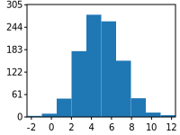
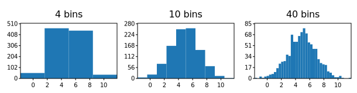
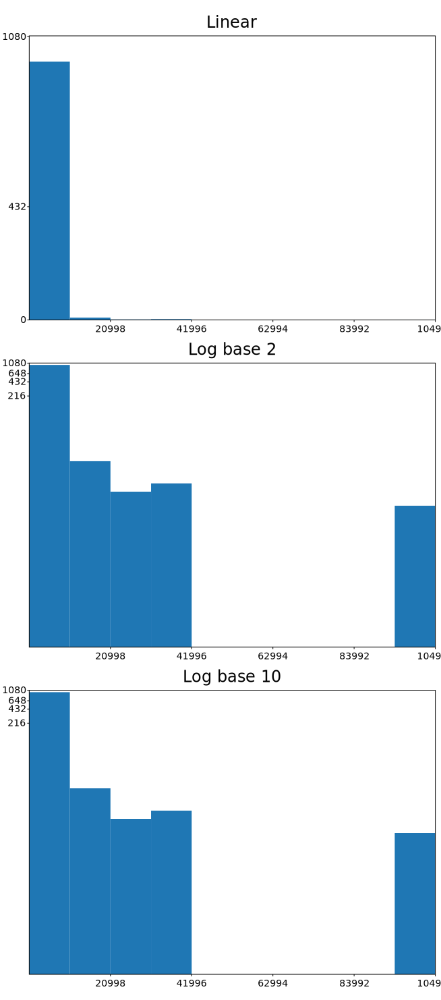
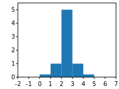

# GNUPlot::hist

The `hist` method provides a way to generate histograms from data, from `svg_cpp_plot::SVGPlot` class. It expectes a single parameter, which are the samples from which the histogram is going to be calculated and plotted:

```cpp
std::mt19937 gen{1}; //Fixed seed
std::normal_distribution<float> d{5,2};
std::list<float> samples;
for (int n=0;n<1000;++n) { samples.push_back(d(gen)); }
svg_cpp_plot::SVGPlot plt;
plt.hist(samples);
plt.savefig("../doc/svgplot/hist/example1.svg");
```

This generates the histogram in its classing appearance:

<div style="text-align:center"></div>

## Binning 
	
By default the histogram is distributed uniformly among *10* bins. However, these can be tweaked through several named attributes (modeled as methods in C++).

The `bins` named attribute can be set as a number (integer) that indicates the number of bins of the histogram:

```cpp
std::mt19937 gen{1}; //Fixed seed
std::normal_distribution<float> d{5,2};
std::list<float> samples;
for (int n=0;n<1000;++n) { samples.push_back(d(gen)); }
svg_cpp_plot::SVGPlot plt;
std::vector<std::size_t> nbins{4,10,40};
for (std::size_t b = 0; b<nbins.size();++b)
    plt.subplot(1,nbins.size(),b).title(std::to_string(nbins[b])+" bins").hist(samples).bins(nbins[b]);
plt.savefig("../doc/svgplot/hist/example2.svg");
```

Note how the number of bins increases, yielding increased resolution on the histogram (at the cost of potential noise):

<div style="text-align:center"></div>
 
 The `weights` named attribute is a sequence of the same size of the samples that defines the weight of each sample (it is otherwise *1*). This can be used to have a weighted average, or to draw a histogram of data that has already been binned (by treating each bin as a single point with a weight equal to its count, although you could use [`bar`](./bar.md) for this).
 
```cpp
svg_cpp_plot::SVGPlot plt;
plt.hist({0,1,2,3,4}).weights({0.2,1,5,1,0.2}).bins(5);
plt.savefig("../doc/svgplot/hist/example3.svg");
```

generates

<div style="text-align:center"></div>
 
By default, the range covered by the histogram is limited by the minimum and maximum values of the samples, but is also possible to control this range with the `range` named attribute:

```cpp
svg_cpp_plot::SVGPlot plt;
plt.hist({0,1,2,3,4}).weights({0.2,1,5,1,0.2}).range({-2,7}).bins(9);
plt.savefig("../doc/svgplot/hist/example4.svg");
```

that yields

<div style="text-align:center"></div>
 
A finer control is granted when the `bin` named attribute is setup as a sequence of values (as opposed to an integer value). The sequence gives bin edges, including left edge of first bin and right edge of last bin. All but the last (righthand-most) bin is half-open. In other words, if bins is *{1, 2, 3, 4}* then the first bin is *\[1, 2)* (including 1, but excluding 2) and the second *\[2, 3)*. The last bin, however, is *\[3, 4\]*, which **includes** 4. Unequally spaced bins are supported if bins is a sequence, and the `range` parameter is ignored. An example of this is given by the following code:

```cpp
svg_cpp_plot::SVGPlot plt;
plt.hist({0,1,2,3,4}).weights({0.2,1,5,1,0.2}).bins({-2,0.5,1.8,2.2,3.5,6});
plt.savefig("../doc/svgplot/hist/example5.svg");
```

that outputs the following graph:

<div style="text-align:center"></div>

## Distribution modifications

The `density` named parameter is a boolean (that can be setup either with a `.density(true)` call or a `.density()` call). If true, the histogram is normalized to form a probability density, i.e., the area (or integral) under the histogram will sum to *1*. This is achieved by dividing the count by the number of observations times the bin width.

The `cumulative` named parameter is a boolean (that can be setup either with a `.cumulative(true)` call or a `.cumulative()` call). If true, then a histogram is computed where each bin gives the counts in that bin plus all bins for smaller values. The last bin gives the total number of datapoints. If `density` is also true then the histogram is normalized such that the last bin equals *1*.

The usage of both booleans is illustrated in the following example (for the same sample points):

```cpp
std::mt19937 gen{1}; //Fixed seed
std::normal_distribution<float> d{5,2};
std::list<float> samples;
for (int n=0;n<1000;++n) { samples.push_back(d(gen)); }
svg_cpp_plot::SVGPlot plt;
plt.subplot(2,2,0).title("Standard").hist(samples);
plt.subplot(2,2,1).title("Cumulative").hist(samples).cumulative();
plt.subplot(2,2,2).title("Density").hist(samples).density();
plt.subplot(2,2,3).title("Density Cumulative.").hist(samples).density().cumulative();
plt.savefig("../doc/svgplot/hist/example6.svg");
```

This example yields the following result that shows how the histograms are affected by both parameters:

<div style="text-align:center"></div>
 
## Formatting

There are also several options also for formatting the histogram and tweaking its appearance. 

For instance, the `histtype` named parameter (represented by a method) defines the type of graph that represents the histogram:
- `"bar"` is a traditional bar-type histogram (default). 
- `"step"` generates a lineplot.

Also, it is possible to choose the orientation of the histogram with the `orientation` named attribute, which can be either `"vertical"` or `"horizontal"`. Both options are illustrated in the follwoing example:

```cpp
std::mt19937 gen{1}; //Fixed seed
std::normal_distribution<float> d{5,2};
std::list<float> samples;
for (int n=0;n<1000;++n) { samples.push_back(d(gen)); }
svg_cpp_plot::SVGPlot plt;
std::vector<std::string> orientations{"vertical","horizontal"};
std::vector<std::string> histtypes{"bar","step"};
for (std::size_t o = 0; o<orientations.size(); ++o) for (std::size_t t = 0; t<histtypes.size(); ++t)
    plt.subplot(orientations.size(),histtypes.size(),t+histtypes.size()*o).hist(samples)
        .orientation(orientations[o]).histtype(histtypes[t]);
plt.savefig("../doc/svgplot/hist/example7.svg");
```

that yields

<div style="text-align:center"></div>


Last, it is also possible to tweak the color of the histogram with the `color` named attribute (represented as a method). Colors are strings:
- Single character strings represent basic colors (```r```  red, ```g```  green, ```b```  blue, ```c``` cyan, ```m``` magenta, ```y```  yellow, ```k```  black, ```w``` white)
- Strings that start with a '#' symbol are considered to be hexadecimal url defined colors.
- Otherwise, the color is considered to be one of the [SVG named colors](https://www.december.com/html/spec/colorsvgsvg.html).

Also, the `alpha` parameter defines transparency, which is specially useful for plotting multiple histograms in the same graph:

```cpp
std::mt19937 gen{1}; //Fixed seed
std::normal_distribution<float> d1{5,2}, d2{-2,4};
std::list<float> samples1, samples2;
for (int n=0;n<1000;++n) { samples1.push_back(d1(gen)); samples2.push_back(d2(gen)); }
svg_cpp_plot::SVGPlot plt;
plt.hist(samples1).range({-10,10}).bins(20).color("blue").alpha(0.5);
plt.hist(samples2).range({-10,10}).bins(20).color("#CC00AA").alpha(0.5);
plt.savefig("../doc/svgplot/hist/example8.svg");
```

This code generates the following graph:

<div style="text-align:center"></div>


