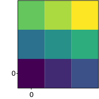
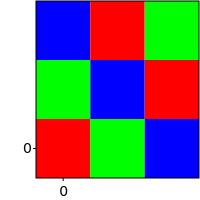
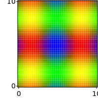

# GNUPlot::imsow

The `imshow` method provides a versatile way of plotting two dimensional data from the `svg_cpp_plot::SVGPlot` class. The simplest example is the following:

```cpp
svg_cpp_plot::SVGPlot plt;
plt.imshow({{0.0,0.1,0.2},
            {0.3,0.4,0.5},
            {0.6,0.7,0.8}});
plt.savefig("../doc/svgplot/imshow/example1.svg");
```

that generates:

<div style="text-align:center"></div>
 
 
The parameter of `imshow` is a two-dimensional array of values. These values can be either floats (as above) or RGB tuples:

```cpp
auto red = std::tuple(1.0f,0.0f,0.0f);
auto green = std::tuple(0.0f,1.0f,0.0f);
auto blue = std::tuple(0.0f,0.0f,1.0f);
svg_cpp_plot::SVGPlot plt;
plt.figsize({200,200});
plt.imshow({{red,green,blue},
            {green,blue,red},
            {blue,red,green}});
plt.savefig("../doc/svgplot/imshow/example2.svg");
```

generating:

<div style="text-align:center"></div>
 
The values can also be RGBA tuples: 

```cpp
auto red = std::tuple(1.0f,0.0f,0.0f,1.0f);
auto green = std::tuple(0.0f,1.0f,0.0f,1.0f);
auto black_transparent = std::tuple(0.0f,0.0f,0.0f,0.5f);
svg_cpp_plot::SVGPlot plt;
plt.figsize({200,200});
plt.imshow({{black_transparent,green,black_transparent},
            {green,black_transparent,red},
            {black_transparent,red,black_transparent}});
plt.savefig("../doc/svgplot/imshow/example3.svg");
```

that yields

<div style="text-align:center"></div>
 
Obviously, there is no need to use bracketed data. Any standard C++ collection can be used:

```cpp
svg_cpp_plot::SVGPlot plt;
plt.figsize({200,200});
std::list<std::list<float>> data;
for (float f = 0.0f; f<=1.0f; f+=0.1f) {
    data.push_back(std::list<float>());
    for (float g = f; g<=1.0f; g+=0.1f) 
        data.back().push_back(f+g);
}
plt.imshow(data);
plt.savefig("../doc/svgplot/imshow/example4.svg");
```

<div style="text-align:center"></div>
 
There is also the possiblity of passing a two dimensional funcion with two lists of positions (in the two axes) to evaluate:

```cpp
svg_cpp_plot::SVGPlot plt;
plt.figsize({200,200});
auto f = [] (float x, float y) {
    float r = 0.5f+0.5f*std::sin(x);
    float g = 0.5f+0.5f*std::sin(y);
    float b = std::max(0.0f,1.0f-(r+g));
    return std::tuple(r,g,b);
};
plt.imshow(svg_cpp_plot::arange(0,10,0.25),svg_cpp_plot::arange(0,10,0.25),f);
plt.savefig("../doc/svgplot/imshow/example5.svg");
```

that generates

<div style="text-align:center"></div>


## Formatting

### Interpolation

It is possible to define different strategies for interpolation. By default the interpolation is `"nearest"` (used in all the examples above), which means that there is no interpolation between the values. This library offers another interpolation option, `"bicubic"`, but with two limitations:
- RGBA values are not supported in bicubuc interpolation.
- The library has to be complied and linked with `libpng`.

This would be an example of bicubic interpolation:

```cpp
svg_cpp_plot::SVGPlot plt;
plt.figsize({200,200});
auto f = [] (float x, float y) {
    float r = 0.5f+0.5f*std::sin(x);
    float g = 0.5f+0.5f*std::sin(y);
    float b = std::max(0.0f,1.0f-(r+g));
    return std::tuple(r,g,b);
};
plt.imshow(svg_cpp_plot::arange(0,10,0.25),svg_cpp_plot::arange(0,10,0.25),f).interpolation("bicubic");
plt.savefig("../doc/svgplot/imshow/example6.svg");
```

that generates a much smoother output

<div style="text-align:center"></div>

