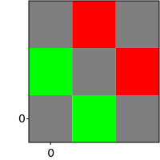
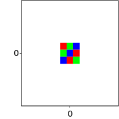
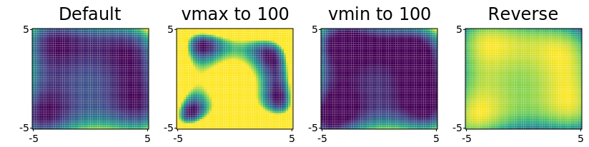
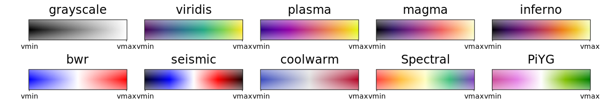

# GNUPlot::imsow

The `imshow` method provides a versatile way of plotting two dimensional data from the `svg_cpp_plot::SVGPlot` class. The simplest example is the following:

```cpp
svg_cpp_plot::SVGPlot plt;
plt.imshow({{0.0,0.1,0.2},
            {0.3,0.4,0.5},
            {0.6,0.7,0.8}});
plt.savefig("../doc/svgplot/imshow/example1.svg");
```

that generates:

<div style="text-align:center"></div>
 
 
The parameter of `imshow` is a two-dimensional array of values. These values can be either floats (as above) or RGB tuples:

```cpp
auto red = std::tuple(1.0f,0.0f,0.0f);
auto green = std::tuple(0.0f,1.0f,0.0f);
auto blue = std::tuple(0.0f,0.0f,1.0f);
svg_cpp_plot::SVGPlot plt;
plt.figsize({200,200});
plt.imshow({{red,green,blue},
            {green,blue,red},
            {blue,red,green}});
plt.savefig("../doc/svgplot/imshow/example2.svg");
```

generating:

<div style="text-align:center"></div>
 
The values can also be RGBA tuples: 

```cpp
auto red = std::tuple(1.0f,0.0f,0.0f,1.0f);
auto green = std::tuple(0.0f,1.0f,0.0f,1.0f);
auto black_transparent = std::tuple(0.0f,0.0f,0.0f,0.5f);
svg_cpp_plot::SVGPlot plt;
plt.figsize({200,200});
plt.imshow({{black_transparent,green,black_transparent},
            {green,black_transparent,red},
            {black_transparent,red,black_transparent}});
plt.savefig("../doc/svgplot/imshow/example3.svg");
```

that yields

<div style="text-align:center"></div>
 
Obviously, there is no need to use bracketed data. Any standard C++ collection can be used:

```cpp
svg_cpp_plot::SVGPlot plt;
plt.figsize({200,200});
std::list<std::list<float>> data;
for (float f = 0.0f; f<=1.0f; f+=0.1f) {
    data.push_back(std::list<float>());
    for (float g = f; g<=1.0f; g+=0.1f) 
        data.back().push_back(f+g);
}
plt.imshow(data);
plt.savefig("../doc/svgplot/imshow/example4.svg");
```

<div style="text-align:center"></div>
 
There is also the possiblity of passing a two dimensional funcion with two lists of positions (in the two axes) to evaluate:

```cpp
svg_cpp_plot::SVGPlot plt;
plt.figsize({200,200});
auto f = [] (float x, float y) {
    float r = 0.5f+0.5f*std::sin(x);
    float g = 0.5f+0.5f*std::sin(y);
    float b = std::max(0.0f,1.0f-(r+g));
    return std::tuple(r,g,b);
};
plt.imshow(svg_cpp_plot::arange(0,10,0.25),svg_cpp_plot::arange(0,10,0.25),f);
plt.savefig("../doc/svgplot/imshow/example5.svg");
```

that generates

<div style="text-align:center"></div>


## Formatting

### Interpolation

It is possible to define different strategies for interpolation, defined as a C++ equivalent of a named attribute. By default the interpolation is `"nearest"` (used in all the examples above), which means that there is no interpolation between the values. This library offers another interpolation option, `"bicubic"`, but with two limitations:
- RGBA values are not supported in bicubuc interpolation.
- The library has to be complied and linked with `libpng`.

This would be an example of bicubic interpolation:

```cpp
svg_cpp_plot::SVGPlot plt;
plt.figsize({200,200});
auto f = [] (float x, float y) {
    float r = 0.5f+0.5f*std::sin(x);
    float g = 0.5f+0.5f*std::sin(y);
    float b = std::max(0.0f,1.0f-(r+g));
    return std::tuple(r,g,b);
};
plt.imshow(svg_cpp_plot::arange(0,10,0.25),svg_cpp_plot::arange(0,10,0.25),f).interpolation("bicubic");
plt.savefig("../doc/svgplot/imshow/example6.svg");
```

that generates a much smoother output

<div style="text-align:center"></div>
 
### Extent

The `extent` named attribute, which in C++ is modeled as a method that can be concatenated with other similar methods, defines the actual range covered by the `imshow` data as a 4D tuple {xmin,xmax,ymin,ymax}. This is useful for adjusting the x-y labels according to the adequate range. For instance the following code

```cpp
svg_cpp_plot::SVGPlot plt;
plt.figsize({200,20}).yticks({});
std::list<std::list<float>> data; 
data.push_back(std::list<float>()); 
for (float f = 0.0f; f<=1.0f; f+=0.1f) data.back().push_back(f);
plt.imshow(data).interpolation("bicubic").extent({0,1,0,1});
plt.savefig("../doc/svgplot/imshow/example7.svg");   
```

yields the following graph

<div style="text-align:center"></div>

Note how the range of the data defined by the list covers the \[0..1\] range in the horizontal axis (instead of the \[0..10\] which would be setup according to the number of data points). 

This attribute also helps locating the data into specific positions within a larger plot. It also enables flipping any of the axis by switching the minimum and maximum on that axis. An example of that is given by 

```cpp
auto red = std::tuple(1.0f,0.0f,0.0f);
auto green = std::tuple(0.0f,1.0f,0.0f);
auto blue = std::tuple(0.0f,0.0f,1.0f);
svg_cpp_plot::SVGPlot plt;
plt.figsize({200,200}).axis({-5,5,-5,5});
plt.imshow({{red,green,blue},
            {green,blue,red},
            {blue,red,green}}).extent({-1,1,1,-1});
plt.savefig("../doc/svgplot/imshow/example8.svg");   
```

that results into 

<div style="text-align:center"></div>
 
Note how the RGB data is centered and flipped on the vertical axis.

In the case of data defined by a 2D function (see examples 4 and 5 above) the extent of the data is already defined as the boundaries of the function.

### Colormaps and limits for values

In the case of arrays of values, the mapping to RGB values is done (like in Matplotlib) through a color map, where the maximum and minimum labeled values are calculated automatically from the data so there is no clamping.

It is possible, however, to specifically set those clamping values through the `vmin` and `vmax` named parameters (represented in C++ as methods). Those parameters can even be inverted (`vmin` being greater than `vmax`) so that the colormap is inverted as well. These options are illustrated in the following example, where several options regarding `vmin` and `vmax` are compared.

```cpp
auto x = svg_cpp_plot::arange(-5,5,0.2);
auto y = svg_cpp_plot::arange(-5,5,0.2);
auto himmelblau = [] (float x, float y) {
    return (x*x + y - 11.0f)*(x*x + y - 11.0f) + (x + y*y -7)*(x + y*y -7);
 };
svg_cpp_plot::SVGPlot plt;
plt.subplot(1,4,0).figsize({200,200}).title("Default").imshow(x,y,himmelblau);
plt.subplot(1,4,1).figsize({200,200}).title("vmax to 100").imshow(x,y,himmelblau).vmax(100);
plt.subplot(1,4,2).figsize({200,200}).title("vmin to 100").imshow(x,y,himmelblau).vmin(100);
plt.subplot(1,4,3).figsize({200,200}).title("Reverse").imshow(x,y,himmelblau).vmin(1000).vmax(0);
plt.savefig("../doc/svgplot/imshow/example9.svg");
```

This example yields the following result:

<div style="text-align:center"></div>
 
It is also possible to change the color map through the `cmap` attribute: a string that defines the mapping from the values to a color that represents them. The usage is illustrated in the following example:

```cpp
auto x = svg_cpp_plot::arange(0,1,0.01);
auto y = svg_cpp_plot::arange(0,1,1);
auto f = [] (float x, float y) { return x; };
svg_cpp_plot::SVGPlot plt;
plt.subplots_adjust().wspace(0.15).left(0.05).right(0.95);
int i = 0;
for (auto cmap : {"grayscale","viridis","plasma","magma","inferno","bwr","seismic","coolwarm","Spectral","PiYG"}) 
    plt.subplot(2,5,i++).figsize({200,100}).yticks({}).xticks({0,1},{"vmin","vmax"}).title(cmap)
        .imshow(x,y,f).interpolation("bicubic").cmap(cmap);

plt.savefig("../doc/svgplot/imshow/example10.svg");
```

There are several color maps available, all of them inspired by Matplotlib, and illustrated in the outcome of the source code above.

<div style="text-align:center"></div>
 
Right now, only perceptually uniform (top row) and divergent (bottom row) color maps are available. More color maps might be added in the future.

The `vmin`, `vmax` and `cmap` named attributes have no effect on RGB or RGBA `imshow` input data.

