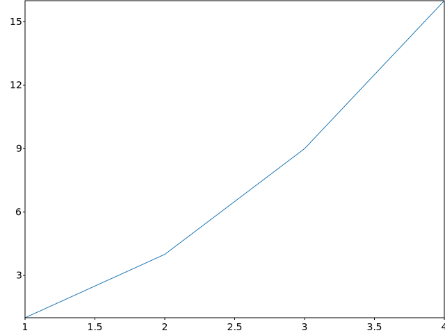
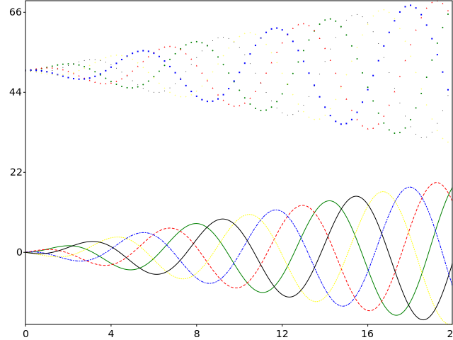
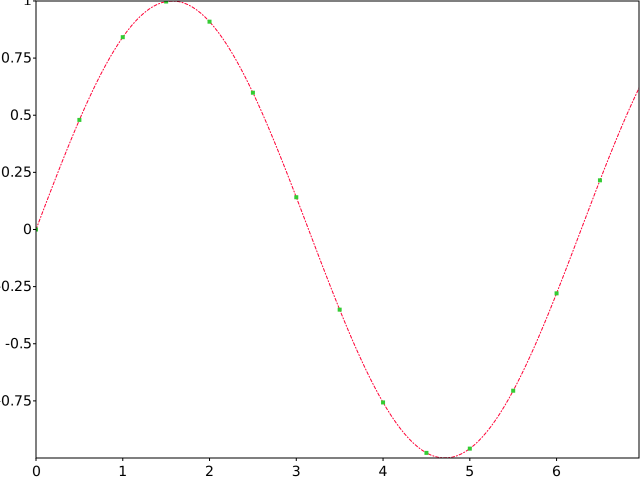

# GNUPlot::plot

The `plot` method provides a versatile and fast way of plotting graphs and curves from the `svg_cpp_plot::SVGPlot` class. Generating visualizations is very quick:

```cpp
svg_cpp_plot::SVGPlot plt;
plt.plot({1,2,3,4});
plt.ylabel("some numbers");
plt.savefig("../doc/example1.svg");
```
generates the following graph:

<div style="text-align:center"></div>
	
You may be wondering why the x-axis ranges from *0-3* and the *y*-axis from *1-4*. If you provide a single list or array to the `plot()` method, it is assumed that it represents a sequence of *y* values, and automatically generates the *x* values for you, starting from *0* (in this case `{0, 1, 2, 3}`).

`plot()` is a versatile method. For example, to plot *x* versus *y*, you can do

```cpp
svg_cpp_plot::SVGPlot plt;
plt.plot({1, 2, 3, 4}, {1, 4, 9, 16});
plt.savefig("../doc/example2.svg");
```
to include also specific values on the *x* axis and therefore generate

<div style="text-align:center"></div>
	

Of course the `plot()` method is not limited to bracketed lists. It can also work with any STL linear container of floating point numbers (such as `std::list<float>`). Additionaly, a python-like `arange(<start>,<stop>,<step>)` is provided as a list generator. These are illustrated in the following code:

```cpp
svg_cpp_plot::SVGPlot plt;
float f=-1.0;
std::list<float> l; 
for (int i=0; i<100;++i) l.push_back(f*=-1.005);
plt.plot(svg_cpp_plot::arange(0,5,0.05),l);
plt.savefig("../doc/example3.svg");
```

that generates 

<div style="text-align:center"></div>

Furthermore, it is also possible to use functions as the *y* parameter. In that case, the function is evaluated for all the real numbers in *x* and plotted accordingly, as follows:

```cpp
svg_cpp_plot::SVGPlot plt;
auto x = svg_cpp_plot::linspace(0,5);
plt.plot(x,[] (float x) { return x*std::sin(x);});
plt.plot(x,sqrtf);
plt.savefig("../doc/svgplot/plot/example4.svg");
```

The above example also illustrates the provided python-like `linspace(<start>,<stop>,<nsamples=50>)` list generator. It generates
generatea the following graph:

<div style="text-align:center"></div>

##Formatting

 There is also a great variety of formatting options that can be setup through formatting strings. Such strings are composed of:
- A color represented by a letter (```r```  red, ```g```  green, ```b```  blue, ```c``` cyan, ```m``` magenta, ```y```  yellow, ```k```  black, ```w``` white), although default colors are chosen for each of the plots if no color is specified.
- A style representation for lines and points (```-``` full line, ```--``` dashed line, ```-.``` chain line, ```..``` small dashed line,  ```o``` cicle marker, ```^``` triangle marker, ```s``` square marker, ```+``` sum marker, ```.``` point marker). By default plots are drawn with lines. 
 
```cpp
svg_cpp_plot::SVGPlot plt;
plt.plot(svg_cpp_plot::arange(0,20,0.05),
        [] (float x) { return x*std::sin(x);},"g-");
plt.plot(svg_cpp_plot::arange(0,20,0.05),
        [] (float x) { return x*std::sin(x+0.4*M_PI);},"r--");
plt.plot(svg_cpp_plot::arange(0,20,0.05),
        [] (float x) { return x*std::sin(x+0.8*M_PI);},"b-.");
plt.plot(svg_cpp_plot::arange(0,20,0.05),
        [] (float x) { return x*std::sin(x+1.2*M_PI);},"y:");
plt.plot(svg_cpp_plot::arange(0,20,0.05),
        [] (float x) { return x*std::sin(x+1.6*M_PI);},"k");
plt.plot(svg_cpp_plot::arange(0,20,0.25),
        [] (float x) { return 50+x*std::sin(x);},"go");
plt.plot(svg_cpp_plot::arange(0,20,0.25),
        [] (float x) { return 50+x*std::sin(x+0.4*M_PI);},"r^");
plt.plot(svg_cpp_plot::arange(0,20,0.25),
        [] (float x) { return 50+x*std::sin(x+0.8*M_PI);},"bs");
plt.plot(svg_cpp_plot::arange(0,20,0.25),
        [] (float x) { return 50+x*std::sin(x+1.2*M_PI);},"y+");
plt.plot(svg_cpp_plot::arange(0,20,0.25),
        [] (float x) { return 50+x*std::sin(x+1.6*M_PI);},"k.");

plt.savefig("../doc/svgplot/plot/example5.svg");
```

The above example tests many format combinations, yielding:

<div style="text-align:center"></div>

Another option to better customize the appearance of each of the plots is through *named attributes*. However, as C++ does not specifically support such feature, these named attributes are implemented as postfix methods, appended consecutively at the end of the `plot` method call.

For markers the following named attributes are provided:
- `markersize(<float>)` sets the size of the marker.
- `marker(<string>)` defines the style of the marker represented as a single charater.
<div style="text-align:center"></div>

For lines the following named attributes are provided:
- `linewidth(<float>)` sets the width of the line.
- `linestyle(<string>)` defines the style of the line (see format strings above).

For both the following named attribute is provided:
- `color(<color>)` sets the color of the marker / line. Colors can be a named color (`svg_cpp_plot::red`), a RGB color (`svg_cpp_plot::rgb(0.2,0.8,0.2)`), a HSV color (`svg_cpp_plot::hsv(0,1,1)`) or a string that represents a color, either named colors `"magenta"`, color URLs `"#FF00EE"` or single char colors (```r```  red, ```g```  green, ```b```  blue, ```c``` cyan, ```m``` magenta, ```y```  yellow, ```k```  black, ```w``` white).

The following is an example of the usage of these named attributes described above:

```cpp
svg_cpp_plot::SVGPlot plt;
plt.plot(svg_cpp_plot::arange(0,7,0.05),[] (float x) { return std::sin(x); })
	.linestyle("-.").color( svg_cpp_plot::hsv(160,1,1)).linewidth(1);
plt.plot(svg_cpp_plot::arange(0,7,0.5),[] (float x) { return std::sin(x); })
	.marker("s").color(svg_cpp_plot::rgb(0.2,0.8,0.2)).markersize(2);
plt.savefig("../doc/svgplot/plot/example6.svg");
```

which yields the following graph:

<div style="text-align:center"></div>


