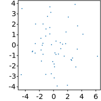
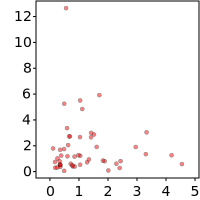
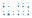

# GNUPlot::scatter

The `scatter` method of the `svg_cpp_plot::SVGPlot` class generates scatter plots: a type of plot or mathematical diagram using Cartesian coordinates to display values for typically two variables for a set of data (passed as the two parameters *x* and *y* of the method). The points can be coded coded (color/shape/size) for displaying additional variables. Generating scatter plots is very quick:

```cpp
std::mt19937 gen{1}; //Fixed seed
std::normal_distribution<float> d{0,2};
std::list<float> x,y;
for (int n=0;n<50;++n) { x.push_back(d(gen)); y.push_back(d(gen)); }
svg_cpp_plot::SVGPlot plt;
plt.scatter(x,y);
plt.figsize({200,200}).savefig("../doc/svgplot/scatter/example1.svg");
```
which generates a scatter plot with points distributed randomly according to a normal distribution:

<div style="text-align:center"></div>
	
As expected, the *x* and *y* parameters can be any C++ collection or bracketed list. Also, if needed (although not very useful for scatter plots), list generators such as `arange(<start>,<stop>,<step>)` and `linspace(<start>,<stop>,<nsamples = 50>)` are provided. Many scatter plots can be included in the same graph through multiple calls of the `scatter` method:

```cpp
std::mt19937 gen{1}; //Fixed seed
std::normal_distribution<float> d{0,1};
svg_cpp_plot::SVGPlot plt;
for (int r = 0; r<3; ++r) {
    std::list<float> x,y;
    for (int s=0;s<25;++s) {
        x.push_back(-12.5+0.5*s+d(gen)); y.push_back(3*r+0.1*s+d(gen));
    }            
    plt.scatter(x,y);
}            
plt.figsize({200,200}).savefig("../doc/svgplot/scatter/example2.svg");
```

which automatically assigns a specific color (with a palette similar to `matplotlib`'s) to each of the scatter plots in order to differenciate them:


<div style="text-align:center"></div>
 
## Formatting

The appearance of a scatter plot can be setup in multiple ways through named parameters (which are represented as methods):

- `s(<float>)`: The marker size in points
- `c(<color>)`: Marker color, which can be a named color (`svg_cpp_plot::red`), a RGB color (`svg_cpp_plot::rgb(0.2,0.8,0.2)`), a HSV color (`svg_cpp_plot::hsv(0,1,1)`) or a string that represents a color, either named colors `"magenta"`, color URLs `"#FF00EE"` or single char colors (```r```  red, ```g```  green, ```b```  blue, ```c``` cyan, ```m``` magenta, ```y```  yellow, ```k```  black, ```w``` white).
- `edgecolors(<color>)`: The color of the edge of the marker, which can be again any color as in the `c(<color>)` named parameter.
- `linewidths(<float>)`: The width of the edge line of the marker.
- `alpha(<float>)`: Transparency of the markers from *0* (totally transparent, invisible) to *100* (totally opaque, default value).

These are illustrated here:

```cpp
std::mt19937 gen{1}; //Fixed seed
std::fisher_f_distribution<float> d(5.0,5.0);
std::list<float> x,y;
for (int n=0;n<50;++n) { 
    x.push_back(d(gen)); y.push_back(d(gen)); 
}
svg_cpp_plot::SVGPlot plt;
plt.scatter(x,y).c("r").alpha(0.5).s(2).edgecolors("black").linewidths(0.5);
plt.figsize({200,200}).savefig("../doc/svgplot/scatter/example3.svg");
```

which generates

<div style="text-align:center"></div>
 
The shape of the marker can be defined by the `marker(<string>)` named parameter. There are multiple enabled options for marker shapes, as illustrated in the following code:

```cpp
svg_cpp_plot::SVGPlot plt; int p=0;
for (std::string marker : {"o",".",",","v",">","^","<","s","+","P","x","X"}) {
    auto& sub = plt.subplot(2,6,p++);
    sub.set_title("'"+((marker!="<")?marker:"&lt;")+"'").fontsize(2);
    sub.axis({-1,1,-1,1}).xticks({}).yticks({}).figsize({5,8}).linewidth(0.01);
    sub.scatter({0},{0}).marker(marker);
 }
plt.savefig("../doc/svgplot/scatter/example4.svg");
```

generates a visualization of all the available marker shapes:

<div style="text-align:center"></div>

## Additional variables

Additional variables can be visualized by modifying each marker's color through the `c(<sequence>)` named parameter, when passing a sequence (C++ collection) of floating point values. The mapping to RGB values is done (like in Matplotlib) through a color map, where the maximum and minimum labeled values are calculated automatically from the data so there is no clamping. It is possible, however, to specifically set those clamping values through the `vmin(<float>)` and `vmax(<float>)` named parameters (represented in C++ as methods). Furthermore, the color map can be specified through the `cmap(<string>)` named parameter. The following color maps are available:

<div style="text-align:center"></div>

The following example illustrates three different color maps for the same set of values:

```cpp
std::mt19937 gen{1}; //Fixed seed
std::uniform_real_distribution<float> d(0,1);
std::list<float> x,y, value;
for (int i=0;i<10;++i) for (int j=0;j<10;++j) for (int s=0;s<3;++s) {
    x.push_back(i+d(gen)); y.push_back(j+d(gen)); value.push_back(sqrt((x.back()-5.0f)*(x.back()-5.0f)+(y.back()-5.0f)*(y.back()-5.0f)));
}
svg_cpp_plot::SVGPlot plt; int p = 0;
for (auto cmap : {"grayscale","viridis","plasma"})
    plt.subplot(1,3,p++).figsize({200,200}).scatter(x,y).c(value).cmap(cmap);
plt.savefig("../doc/svgplot/scatter/example5.svg");
```

which generates

<div style="text-align:center"></div>

It is also possible not only to set values through a sequence of floating point numbers in `c(<sequence>)` but also specific colors through a sequence of RGB tuples, as illustrated in the following code:

```cpp
svg_cpp_plot::SVGPlot plt;
plt.scatter({0,0,0},{0,2,4}).c({{0,1,0.25},{1.0,0.75,0},{0.75,0.25,0.25}});
plt.figsize({10,25}).axis({-2,2,-2,6}).xticks({}).yticks({}).linewidth(0);
plt.savefig("../doc/svgplot/scatter/example6.svg");
```

which generates:

<div style="text-align:center"></div>
 
In this case the parameters `cmap`, `vmin` and `vmax` will just be ignored.

Actually, multiple variables can be defined: in scatter plots, most named parameters that define appearance can be translated into a sequence, enabling new ways of showing information through the markers size (`s`) and border width (`linewidth`). The following illustrates different sizes for the same scatter plot:

```cpp
svg_cpp_plot::SVGPlot plt;
plt.scatter({0,0,0},{0,2,3.5}).s({4,3,2});
plt.scatter({0},{3.4}).s(0.4).marker("v");
plt.scatter({-0.3,0.3,-0.3,-0.1,0.1,0.3},{3.8,3.8,3.2,3.2,3.2,3.2}).s({0.4,0.4,0.3,0.2,0.2,0.3}).marker("+");
plt.figsize({10,25}).axis({-2,2,-2,5}).xticks({}).yticks({}).linewidth(0);
plt.savefig("../doc/svgplot/scatter/example7.svg");
```

yielding

<div style="text-align:center"></div>


