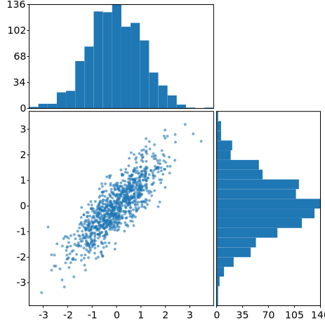
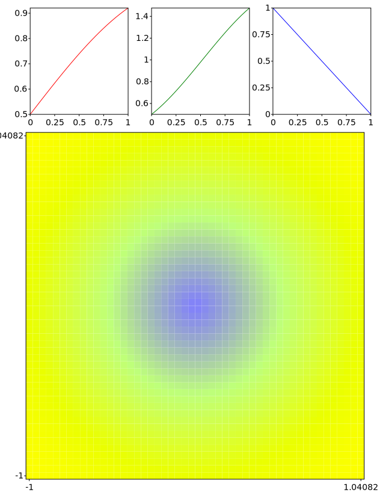

# GNUPlot::subplot

The method `subplot(nrows,ncols,index)` adds a subplot to the current figure and returns a reference to it (`svg_cpp_plot::SVGPlot&`). The SVGPlot from which this methods is called will be composed of subplots and have no plots of its own. The subplot will take the `index` position on a grid with `nrows` rows and `ncols` columns. `index` starts at 0 in the upper left corner and increases to the right (note that `matplotlib`'s subplot method starts at index 1, but in this library we choose 0 as starting index because it is more C++y).

As the `subplot` method returns a reference to a new `svg_cpp_plot::SVGPlot`, it is rather simple to compose figures with subplots (it is possible to directly call . The following code

```cpp
svg_cpp_plot::SVGPlot plt; 
for (int spx = 0; spx < 3; ++spx) for (int spy = 0; spy < 3; ++spy)
    plt.subplot(3,3,spy*3+spx).plot(
        svg_cpp_plot::linspace(0.0,2.0*M_PI,100),
        [&] (float x) { return std::sin(float(spx+1)*x)*std::sin(4*float(spy+1)*x); });
plt.savefig("../doc/svgplot/subplot/example1.svg");
```

generates the following graph

<div style="text-align:center"></div>

The subplots can modify all their properties for visualization (title, size, ticks...) the same way than plots do, as the following code illustrates:

```cpp
svg_cpp_plot::SVGPlot plt; 
auto x = svg_cpp_plot::linspace(0.0,1.0,100);
for (int p = 0; p<4;++p) plt.subplot(2,2,p).figsize({200,200}).xticks({}).yticks({});
plt.subplot(2,2,0).title("sqrt(x)").plot(x,sqrtf);
plt.subplot(2,2,1).title("sqr(x)").plot(x,[] (float x) { return x*x; });
plt.subplot(2,2,2).title("log(x+1)").plot(x,[] (float x) { return std::log(x+1); });
plt.subplot(2,2,3).title("exp(x)").plot(x,expf);
plt.savefig("../doc/svgplot/subplot/example2.svg");
```

That code modifies sizes, ticks and titles for each of the subplots, yielding the following result:

<div style="text-align:center"></div>
 
The sizes for each subplot can be irregular, and the subplot positioning will do its best to adapt the positions while preserving the corresponding sizes as described by the `figsize` named parameter. Also, some subplots might be empty (if you never access to one of the indices then the corresponding space will be empty). This is illustrated here:

```cpp
std::mt19937 gen{1}; //Fixed seed
std::normal_distribution<float> d{0,1};
std::list<float> x, y;
for (int n=0;n<1000;++n) { 
    y.push_back(d(gen)); x.push_back(0.8*y.back() + 0.5*d(gen));
}
svg_cpp_plot::SVGPlot plt; 
plt.subplot(2,2,2).figsize({300,300}).scatter(x,y).s(2).alpha(0.6);
plt.subplot(2,2,0).figsize({300,150}).xticks({}).hist(x).bins(20).orientation(svg_cpp_plot::vertical);
plt.subplot(2,2,3).figsize({150,300}).yticks({}).hist(y).bins(20).orientation(svg_cpp_plot::horizontal);
plt.savefig("../doc/svgplot/subplot/example3.svg");
```

that generates a figure with some subplots of uneven sizes and some empty space:

<div style="text-align:center"></div>
 
Last, as the `subplot` method of the `svg_cpp_plot::SVGPlot` class actually returns `svg_cpp_plot::SVGPlot&`, subplots can be constructed recursively to define sophisticated layouts:

```cpp
auto r = [] (float x) { return 0.5f+0.5f*std::sin(x); };
auto g = [] (float x) { return 0.5f+x*std::sin(x+M_PI/4.0); };
auto b = [] (float x) { return 1.0 - x; };
auto f = [&] (float x, float y) {
    float d = std::sqrt(x*x+y*y);
    return std::tuple(r(d),g(d),b(d));
};        
svg_cpp_plot::SVGPlot plt;
plt.subplot(2,1,0).subplot(1,3,0).figsize({200,200}).plot(svg_cpp_plot::linspace(0,1,25),r).color("red");
plt.subplot(2,1,0).subplot(1,3,1).figsize({200,200}).plot(svg_cpp_plot::linspace(0,1,25),g).color("green");
plt.subplot(2,1,0).subplot(1,3,2).figsize({200,200}).plot(svg_cpp_plot::linspace(0,1,25),b).color("blue");
plt.subplot(2,1,1).figsize({600,600}).imshow(svg_cpp_plot::linspace(-1,1,50),svg_cpp_plot::linspace(-1,1,50),f);
plt.savefig("../doc/svgplot/subplot/example4.svg");
```

that generates the following subplot distribution:

<div style="text-align:center"></div>


## Subplot positioning

The default positioning of the subplots might not meet your needs, but it can be adjusted through the `subplots_adjust()` method that has the following named parameters (remember that named parameters are expressed as concatenated methods in this library):

- `left`: The position of the left edge of the subplots, as a fraction of the figure width.
- `right`: The position of the right edge of the subplots, as a fraction of the figure width.
- `bottom`: The position of the bottom edge of the subplots, as a fraction of the figure height.
- `top`: The position of the top edge of the subplots, as a fraction of the figure height.
- `hspace`: The width of the padding between subplots, as a fraction of the average subplot width.
- `vspace`: The height of the padding between subplots, as a fraction of the average subplot height.

As an example, we modify one of the examples above adjusting all the subplot adjustment parameters:
```cpp 
std::mt19937 gen{1}; //Fixed seed
std::normal_distribution<float> d{0,1};
std::list<float> x, y;
for (int n=0;n<1000;++n) { 
    y.push_back(d(gen)); x.push_back(0.8*y.back() + 0.5*d(gen));
}
svg_cpp_plot::SVGPlot plt; 
plt.subplots_adjust().hspace(0).wspace(0).left(0.05).right(0.95).top(0.05).bottom(0.95);
plt.subplot(2,2,2).figsize({300,300}).scatter(x,y).s(2).alpha(0.6);
plt.subplot(2,2,0).figsize({300,150}).xticks({}).hist(x).bins(20).orientation(svg_cpp_plot::vertical);
plt.subplot(2,2,3).figsize({150,300}).yticks({}).hist(y).bins(20).orientation(svg_cpp_plot::horizontal);
plt.savefig("../doc/svgplot/subplot/example5.svg");
```


returning a new graph with shorter distance between the plots:
<div style="text-align:center"></div>

